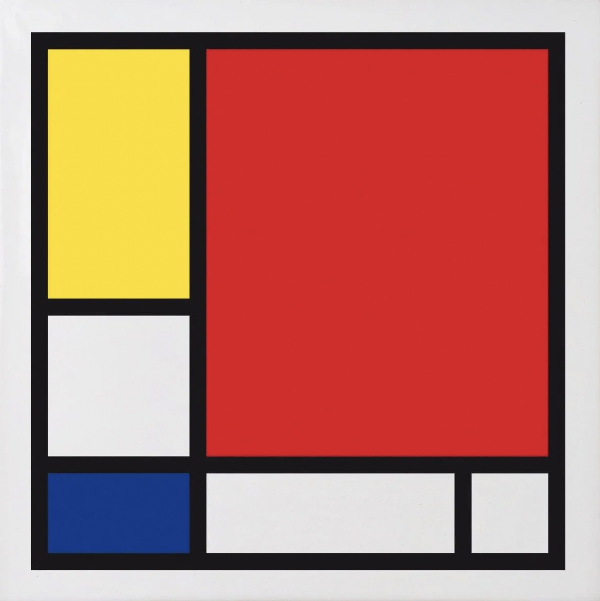
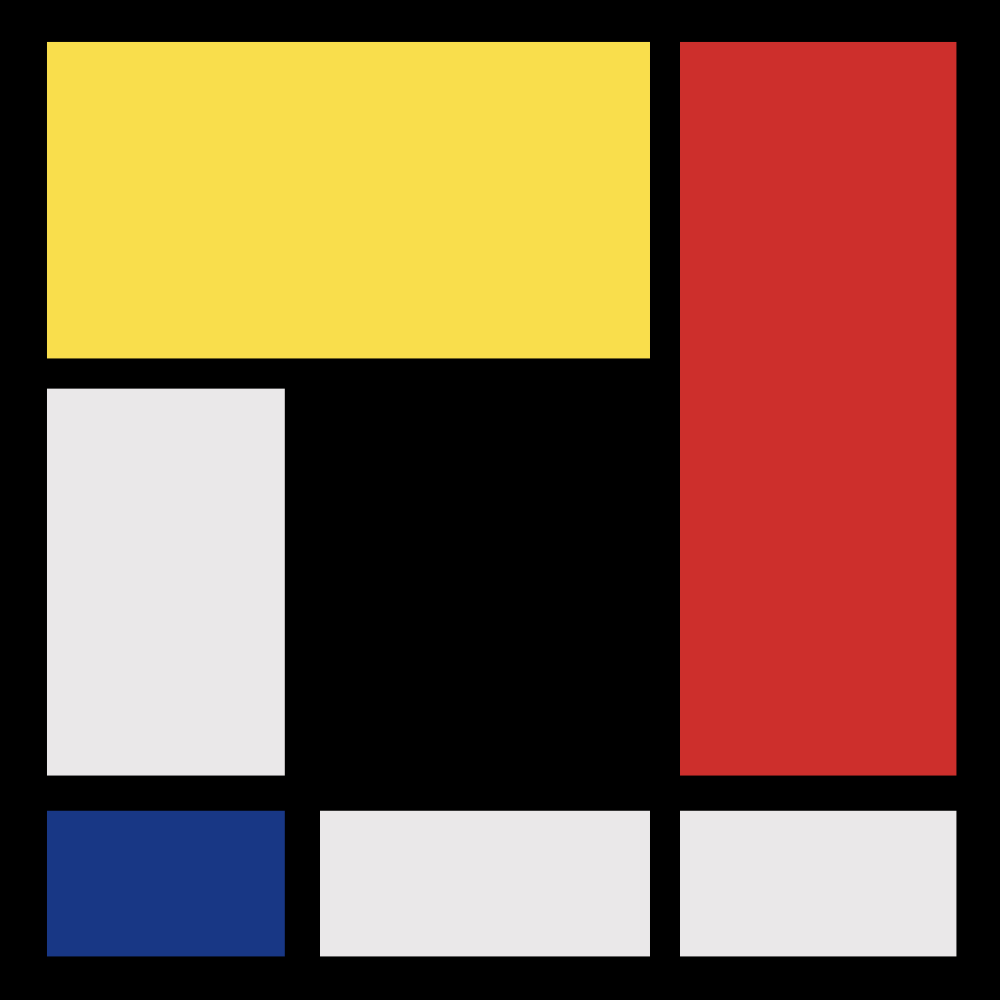
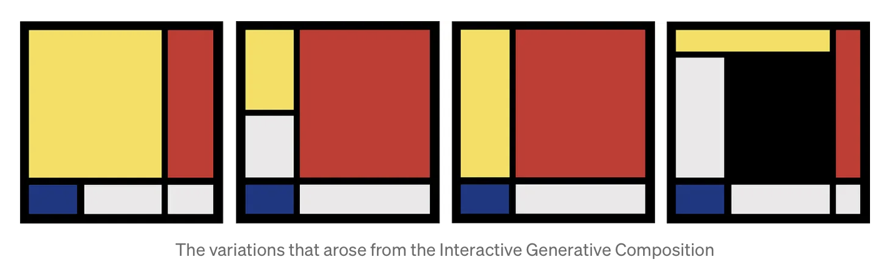
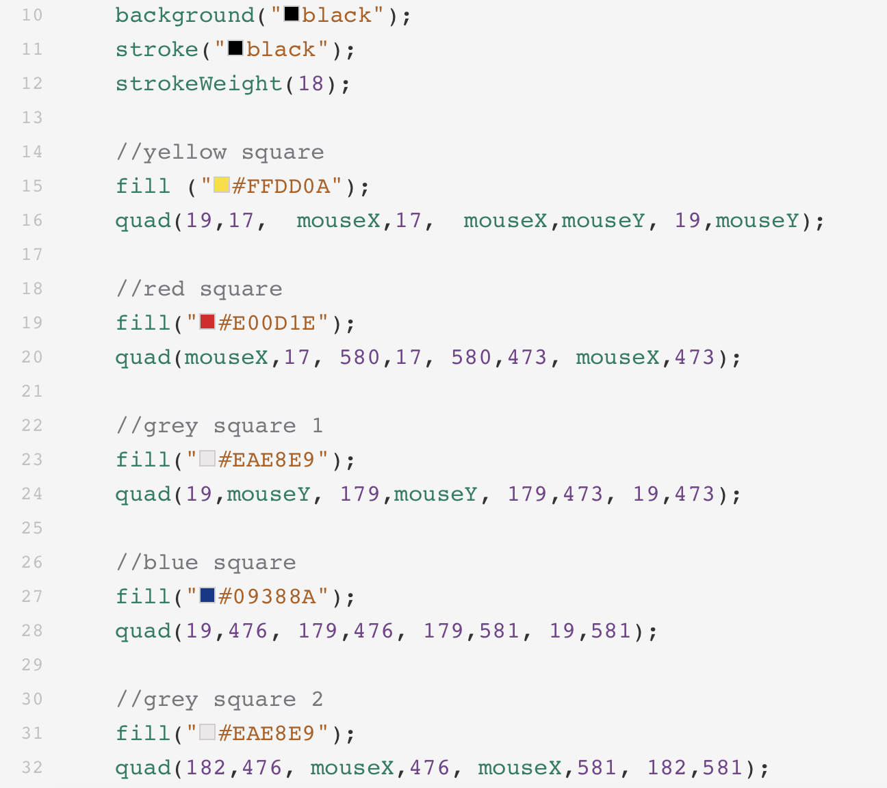

# ywan0367_9103_tut1
## Quiz 8

The artwork my group chose from the provided selection is 'Broadway Boogie Woogie’ by Piet Mondrian, which comprises hundreds of rectangles. I found this replica of Mondrian’s artwork generated by P5.js online. This replica uses code to randomly displace the geometric hierarchy, creating a new composition while still following Mondrian’s Neoplasticism approach. I think it's a beneficial technique for me to incorporate into my project since we need to duplicate the artwork and add interestingness to it. Changing the scale of the rectangle is an effective method to increase visual interest.
### Composition with Red, Blue and Yellow — Pier Mondrian ( 1930 )

### Interactive Generative Composition

### The variations that arose from the Interactive Generative Composition

### Part of the inspiration code

This set of code uses the “quad() function” to draw quadrilaterals and p5.js parameters mouseX and mouseY to set the logo's position in "interactive" mode. We could use the “quad() function” to create a shape similar to a rectangle, but the angles between two edges are not constrained to 90 degrees. Using the mouse control functions and parameters could also give audiences a chance to interact with the work. I think these function could be a powerful method to help me create the final output. 
### Link to the inspiration code
[Link Text](https://openprocessing.org/sketch/1558289)